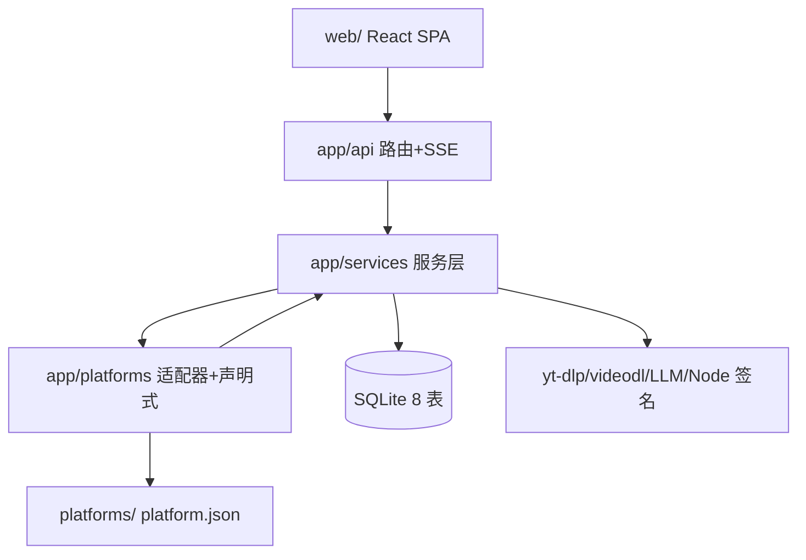

# FavAPI

本地/私有化部署的「个人收藏数据同步中台」：FastAPI + Playwright/HTTP 双通道抓取 8 个平台（抖音/B站/小红书/快手/TikTok/Threads/YouTube/微信收藏导入）的个人收藏与点赞，支持多账号登录态管理、定时调度、视频下载队列、LLM 自动打标，SQLite 持久化，React SPA 管理控制台。技术栈：Python 3.13 / FastAPI / aiosqlite（裸 SQL）/ Playwright / curl_cffi；前端 React 19 + Vite 6 + Tailwind 4。

单进程 uvicorn（默认 127.0.0.1:8300），平台扩展走「适配器注册表 + JSON 声明式」双层体系。产品事实来源 [PRD.md](./PRD.md)，API 直连接入指南 [docs/api-fetch-integration-guide.md](./docs/api-fetch-integration-guide.md)。

## 约定的规则

- Python 用项目内 venv（Windows `.venv/Scripts/python.exe`，macOS `.venv/bin/python`）；系统默认 `python` 可能是外部 venv，禁止用它装依赖。
- 启动/测试统一走 `procm-commands.json`（Win/mac 双套 + 前端 web）；改代码后用 procm 重启服务。
- 浏览器操作必须经 `browser.session()`（profile 锁 + 全局 2 并发）；抓取保持有头（`FAVAPI_HEADLESS=0`）。
- 新增平台：简单拦截写根 `platforms/<name>/platform.json`（声明式，可热加载）；复杂的实现 `BasePlatformAdapter` 并在 `registry.py` 注册，页面与校验自动生效。
- 测试必须用 `FAVAPI_DATA_DIR` 隔离；不要读写 `data/`（真实登录态）。根目录 `verify_bili_*.py` 含真实 cookie，勿当测试维护。
- Windows dev 模式必须 `--loop asyncio:ProactorEventLoop`（procm dev 命令已内置），否则 Playwright/子进程报 NotImplementedError。
- 更多约定见 [开发约定](claude/conventions.md)。

## 文件索引

| 文件 | 用途 | 何时阅读 |
|------|------|----------|
| [架构总览](claude/overview.md) | 分层结构、三模式抓取、运行时形态、设计取舍 | 理解整体架构 / 改动跨层时 |
| [开发约定](claude/conventions.md) | 命令、双平台环境、代码风格、新增平台流程 | 动手写代码前 |
| [模块职责](claude/module-responsibilities.md) | api/services/platforms 各文件职责边界 | 定位改动位置时 |
| [入口与启动](claude/entrypoints.md) | 启动流程、lifespan、后台任务、部署顺序 | 启动/部署/调试初始化问题时 |
| [对外接口](claude/public-interfaces.md) | REST API 全表、SSE、代码级扩展接口 | 调 API / 改接口时 |
| [依赖与配置](claude/dependencies-and-config.md) | 依赖、环境变量、settings.json、platform.json spec | 改配置 / 排查环境问题时 |
| [数据模型](claude/data-model.md) | SQLite 8 表、写入策略、内存态、标签体系 | 涉及存储/字段时 |
| [测试与质量](claude/testing-and-quality.md) | 7 个测试脚本、人工验证路径、质量风险 | 验证改动 / 评估风险时 |
| [文件地图](claude/file-map.md) | 目录树与修改热点 | 找文件时 |
| [FAQ](claude/faq.md) | 常见问题与定位路径 | 遇到报错/异常行为时 |
| [changelog](claude/changelog.md) | 本索引的生成/更新记录 | 重跑 /init-project 时 |

## 模块索引

| 模块 | 职责 | 索引 |
|------|------|------|
| `app/` | Python 后端主体（api / services / platforms / web 托管） | 详情见 [claude/module-responsibilities.md](claude/module-responsibilities.md) |
| `platforms/` | 声明式平台 JSON 配置（FAVAPI_PLATFORMS_DIR） | 同上 |
| `web/` | React SPA 管理控制台（独立 npm 工程） | [web/CLAUDE.md](./web/CLAUDE.md) |
| `tests/` | parser/api_client 单测 + 冒烟 + e2e | [claude/testing-and-quality.md](claude/testing-and-quality.md) |

## 扫描状态

- 更新时间：2026-09-17 22:36（第二次运行，全量增量更新）。
- 已扫描：后端 78 个 Python 源文件 + web/ 约 50 个前端源文件（两个并行探索代理）；procm-commands.json、PRD/README 核对。
- 跳过：`data/`（运行时）、`node_modules/`、`.venv/`、锁文件、各平台 `api_client.py` 签名细节逐行审（已由 adapter 层描述覆盖）。
- 下一步建议：拆分 `web/src/components/Data/DataBrowserView.tsx`（≈1990 行）前先补扫该文件；codegraph 索引滞后于源码，以 git 文件为准。
