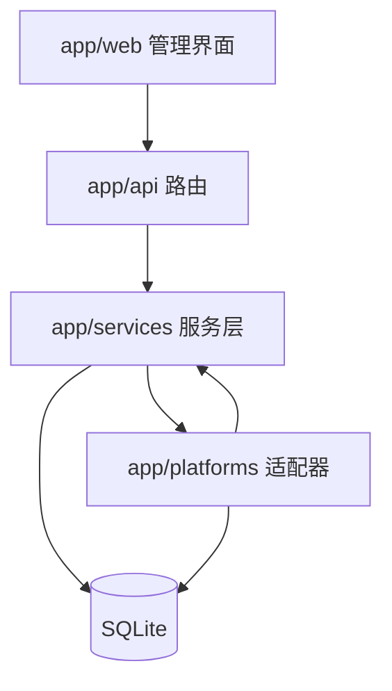

# FavAPI

本地/私有化部署的「个人收藏数据同步中台」：FastAPI + Playwright 通过真实浏览器登录态抓取各平台个人收藏（抖音完整实现，Bilibili 占位），多账号 Session 管理，结果持久化 SQLite，附带 Jinja2 Web 管理界面。技术栈：Python 3.13 / FastAPI / aiosqlite（裸 SQL 无 ORM）/ Playwright async / Jinja2 + 原生 JS。

单进程 uvicorn 服务（默认 127.0.0.1:8300），单 aiosqlite 连接（WAL），平台扩展走适配器注册表模式。产品需求的事实来源是 [PRD.md](./PRD.md)。

## 约定的规则

- Python 一律用项目内 `.venv/Scripts/python.exe`；系统默认 `python` 是外部 venv，禁止用它装依赖。
- 启动/测试命令统一走 `procm-commands.json`（server / dev / test-parser / test-smoke / install-browser）；改代码后用 procm 重启服务。
- 抖音功能保持有头浏览器（`FAVAPI_HEADLESS=0`），抓取中弹窗属预期；浏览器操作必须经 `browser.session()`（profile 锁 + 并发信号量）。
- 新增平台：实现 `BasePlatformAdapter` 三方法 + 在 `registry.py` 注册，页面与校验自动生效。
- 测试必须用 `FAVAPI_DATA_DIR` 隔离数据；不要读写 `data/`（真实登录态）。
- 依赖未锁版本；升级 fastapi/starlette 注意 `TemplateResponse(request, name, context)` 新签名。
- 更多约定见 [开发约定](claude/conventions.md)。

## 文件索引

| 文件 | 用途 | 何时阅读 |
|------|------|----------|
| [架构总览](claude/overview.md) | 分层结构、运行时形态、设计取舍、数据流 | 理解整体架构 / 改动跨层时 |
| [开发约定](claude/conventions.md) | 命令、环境、代码风格、禁止事项 | 动手写代码前 |
| [模块职责](claude/module-responsibilities.md) | 各子包与文件的职责边界 | 定位改动位置时 |
| [入口与启动](claude/entrypoints.md) | 启动流程、lifespan、后台任务、部署顺序 | 启动/部署/调试初始化问题时 |
| [对外接口](claude/public-interfaces.md) | REST API 全表、Web 页面路由、扩展接口 | 调 API / 改接口时 |
| [依赖与配置](claude/dependencies-and-config.md) | 依赖、环境变量、常量、配置文件 | 改配置 / 排查环境问题时 |
| [数据模型](claude/data-model.md) | SQLite 四表、Pydantic 模型、内存态 | 涉及存储/字段时 |
| [测试与质量](claude/testing-and-quality.md) | 测试命令、覆盖范围、已知质量风险 | 验证改动 / 评估风险时 |
| [文件地图](claude/file-map.md) | 目录树与关键文件速查 | 找文件时 |
| [FAQ](claude/faq.md) | 常见问题与定位路径 | 遇到报错/异常行为时 |
| [changelog](claude/changelog.md) | 本索引的生成/更新记录 | 重跑 /init-project 时 |

## 模块索引

单模块项目，核心包 `app/` 内子包：

| 路径 | 职责 |
|------|------|
| `app/api/` | HTTP 路由（accounts / fetch / queries） |
| `app/services/` | 服务层（browser / account_manager / data_store / task_executor） |
| `app/platforms/` | 平台适配器（base / registry / douyin / bilibili） |
| `app/web/` | Jinja2 管理界面（4 页面） |
| `tests/` | parser 单测 + API 冒烟 |

## 扫描状态

- 更新时间：2026-09-10 18:26（首次生成）。
- 已扫描：全部 24 个 Python 源文件（100%）、PRD/README 及构建期规划文档；未识别出需独立索引的子模块。
- 跳过：`app/web/templates/*.html`（5 个，仅确认展示层职责）、`data/`（运行时生成）、`.codegraph/`。
- 下一步建议：无急迫缺口；新增平台或模板复杂化后重跑 `/init-project` 做增量更新。
